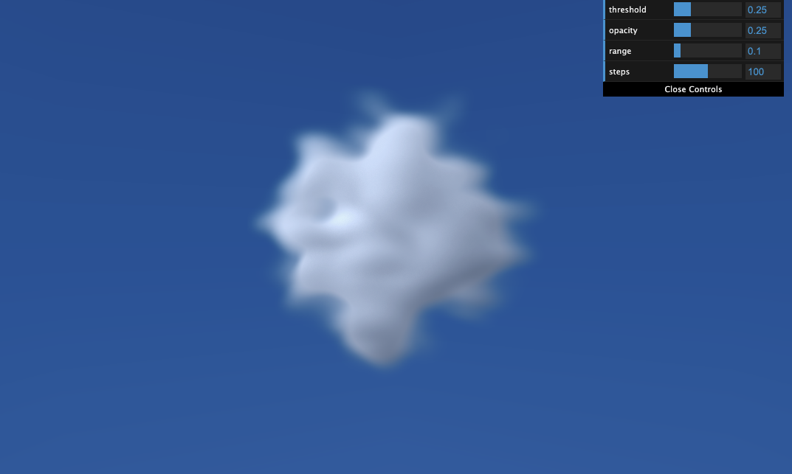

# Clouds

- [Clouds](#clouds)
  - [threejs-sample](#threejs-sample)

## threejs-sample

- [demo link](https://daehungwak.github.io/web-ui-archive/clouds/threejs-sample/)
- [readme.md](./threejs-sample/README.md)

