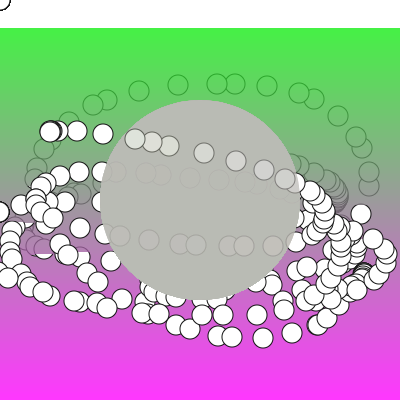

# 크리에이티브 코딩 101 라이브 튜토리얼

- [크리에이티브 코딩 101 라이브 튜토리얼](https://page.stibee.com/archives/97941)을 따라해보고 응용해보는 과정
- [ArtistWhoCode 유튜브 채널](https://www.youtube.com/artistwhocode)
- `p5js`를 사용
- 2주 1회

## demos

- 01

  - [p5js tutorials - 1.0](https://daehungwak.github.io/creative-archives/creative-coding-101/01/p5js-tutorials/1.0/)
  
    

  - [p5js tutorials - 1.1](https://daehungwak.github.io/creative-archives/creative-coding-101/01/p5js-tutorials/1.1/)

    

  - [p5js tutorials - 1.2](https://daehungwak.github.io/creative-archives/creative-coding-101/01/p5js-tutorials/1.2/)

    

  - [p5js tutorials - 1.3](https://daehungwak.github.io/creative-archives/creative-coding-101/01/p5js-tutorials/1.2/)

    
